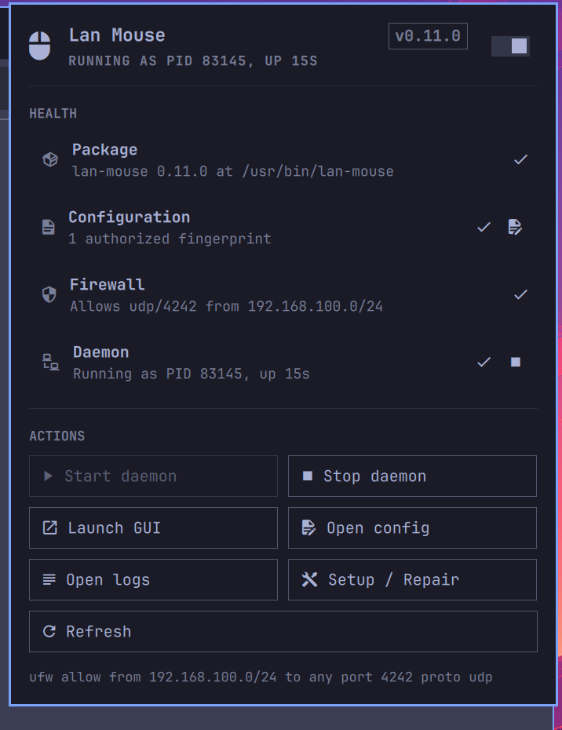

# Omarchy Lan Mouse

An Omarchy bar widget for installing, diagnosing, and controlling the
[Lan Mouse](https://github.com/feschber/lan-mouse) keyboard and mouse-sharing
daemon from the active Hyprland/Wayland session.

The bar icon says whether the daemon is up. The panel behind it says why not.



## Install

```bash
omarchy plugin add https://github.com/matthewelgert/omarchy-lan-mouse.git
omarchy plugin enable io.github.matthewelgert.lan-mouse --section right
```

Plugins land disabled so you can read the code before running it. To install
by hand instead, copy this directory to
`~/.config/omarchy/plugins/io.github.matthewelgert.lan-mouse/`, then
`omarchy-shell shell rescanPlugins`.

## Important architecture decision

Lan Mouse is launched by the plugin as the logged-in Omarchy user:

```sh
lan-mouse daemon
```

There is **no systemd service**, by design. The daemon needs the active
graphical session's Wayland socket and portal environment, which it inherits
by being started from the running shell. A user unit would be a second,
competing lifetime for something the session already owns.

That leaves the plugin responsible for knowing which process is its own. It
writes exactly one PID to:

```text
$XDG_RUNTIME_DIR/omarchy-lan-mouse/lan-mouse.pid
```

This location is per user and cleared at logout, so a PID from a previous
session can never be mistaken for a live daemon.

**Start is idempotent.** It verifies the recorded PID is a live
`lan-mouse daemon` before launching anything, so repeated clicks cannot
produce two daemons fighting over the same port.

**Stop is targeted.** It re-verifies the PID against `/proc` immediately
before every signal — command name, arguments, and owning UID — then sends
SIGTERM, waits, and escalates to SIGKILL only if needed. There is deliberately
no `pkill`, no `killall`, and no matching by process name.

A `lan-mouse` you started by hand is therefore *reported* but never touched:
the Daemon row reads "Running outside this plugin (PID …)" and Stop leaves it
alone.

## Health

Four independent checks, each with its own verdict and its own fix:

| Row | Reports | Fixed by |
|-----|---------|----------|
| Package | Whether `lan-mouse` is on `PATH`, and its version | Setup / Repair |
| Configuration | Whether `~/.config/lan-mouse/config.toml` exists, and how many fingerprints it authorizes | Open config, or pair from the GUI |
| Firewall | Whether UFW admits udp/`port` from `subnet`, and whether UFW is enabled at all | Setup / Repair |
| Daemon | Whether the tracked process is alive, its uptime, and whether an untracked one exists | Start / Stop |

`scripts/health-check` emits this as one JSON object and is safe to run by
hand. Every probe is read-only and unprivileged — the panel polls it on a
timer, so it never prompts, installs, or changes state.

Reading UFW normally needs root. Rather than prompt on a timer, the check
tries `sudo -n ufw status` (exact, but only when sudo is already unlocked),
falls back to the world-readable `/etc/ufw/user.rules`, and reports `unknown`
rather than guessing when neither is available.

## Setup / Repair

Opens a floating terminal so the authentication prompt is visible and answered
by you, then runs three fixed commands:

```sh
sudo pacman -S --needed --noconfirm lan-mouse
sudo ufw allow from <subnet> to any port <port> proto udp comment 'Lan Mouse'
sudo ufw status verbose
```

Both steps are safe to repeat, which is what makes this a repair action as
well as a setup one: pacman skips an up-to-date package and ufw skips a rule
it already has. (`--needed` is the one deviation from a plain `-S`; without it
Repair would reinstall the package every time.)

The subnet and port are the only inputs, and they pass three gates before
reaching `ufw`:

1. `Model.js` validates them and refuses to build the command otherwise — an
   invalid setting disables the button rather than falling back to the default,
   because opening the firewall for a subnet you did not ask for is worse than
   doing nothing.
2. They are passed as an argv vector through `Util.shellQuote`, so they cross
   the terminal launcher as literal arguments rather than shell text.
3. `scripts/setup-repair` re-validates them, because a caller is not a trust
   boundary, and passes them to `pacman` and `ufw` as argv — never
   interpolated into a shell string.

The panel prints the exact rule it would add along the bottom edge, so the
privileged action is legible before it is triggered.

## Controls

| Action | Key | What it does |
|--------|-----|--------------|
| Start daemon | `S` | `lan-mouse daemon` in this session; idempotent |
| Stop daemon | `X` | Terminates only the tracked PID |
| Launch GUI | `G` | `lan-mouse`, for pairing and trust authorization |
| Open config | `C` | `config.toml` in your Omarchy editor |
| Open logs | `L` | Follows the daemon log |
| Setup / Repair | `U` | The authenticated terminal above |
| Refresh | `R` | Re-runs the health check |

Arrow keys move between the action buttons, Enter activates, Escape closes.

On the bar icon: left click opens the panel, right click refreshes, middle
click launches the GUI.

### Logs

With no systemd unit there is no journal to read, so `scripts/start-daemon`
redirects the daemon's stdout and stderr to
`$XDG_RUNTIME_DIR/omarchy-lan-mouse/lan-mouse.log` and rotates it past 1 MB.
Open logs tails that file.

## Settings

Set per instance in `~/.config/omarchy/shell.json`, or through
Setup > Plugins.

| Key | Default | Meaning |
|-----|---------|---------|
| `subnet` | `192.168.100.0/24` | IPv4 CIDR allowed through the firewall |
| `port` | `4242` | UDP port the daemon listens on |
| `refreshIntervalSec` | `30` | Health poll interval while the panel is closed |

The panel polls every 5 seconds while open so Start and Stop settle visibly.

## IPC

```bash
omarchy-shell io.github.matthewelgert.lan-mouse status   # one-line summary
omarchy-shell io.github.matthewelgert.lan-mouse toggle   # show/hide the panel
omarchy-shell io.github.matthewelgert.lan-mouse start
omarchy-shell io.github.matthewelgert.lan-mouse stop
omarchy-shell io.github.matthewelgert.lan-mouse refresh
```

`open`, `close`, `gui`, `config`, `logs`, and `setup` are also available.

## Layout

```text
manifest.json      plugin identity, settings schema
BarWidget.qml      bar icon, IPC target, panel host
Panel.qml          health rows, actions, keyboard navigation
Model.js           validation, health parsing, severity — pure, node-testable
scripts/
  lib.sh           shared paths, validation, PID verification
  health-check     read-only JSON health report
  start-daemon     idempotent start
  stop-daemon      verified, targeted stop
  setup-repair     the privileged terminal action
  open-logs        tails the daemon log
```

## Credits

- [Lan Mouse](https://github.com/feschber/lan-mouse) by feschber.
- [Omarchy](https://github.com/basecamp/omarchy) by Basecamp.
- [Omarchy plugin development guide](https://omarchyplugins.com/develop.html).

This is an independent integration and is not affiliated with either upstream
project.
